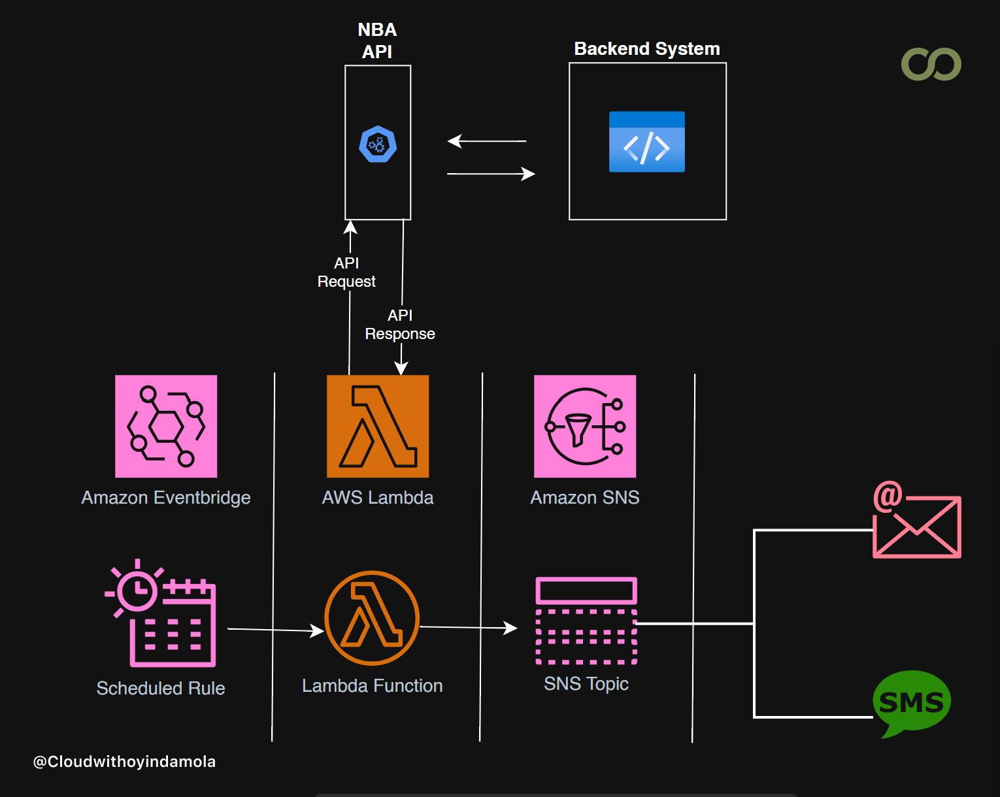

# NBA Game Day Notification/Alert System

## **Project Overview**
The NBA Game Day Notifications System is a cloud-based solution that provides real-time NBA game score updates to subscribed users via SMS and email. It integrates AWS Services like **SNS**, **Lambda**, and **EventBridge** with the **NBA API** to deliver timely notifications, showcasing efficient cloud computing and automation.

---

## **Features**
- Fetches live NBA scores using the NBA API.
- Sends formatted updates via SMS or email through Amazon SNS.
- Automates notifications using EventBridge schedules.
- Adheres to AWS security best practices with least privilege IAM policies.

## **Prerequisites**
- NBA API Access: Obtain a free account and API key from [sportsdata.io](https://sportsdata.io/)
- AWS Account: Basic understanding of AWS and Python is recommended.

---

---


## **Technologies Used**
- **Cloud Provider**: AWS
- **Core Services**: SNS, Lambda, EventBridge
- **Programming Language**: Python 3.x
- **External API**: NBA Game API (SportsData.io)
- **IAM Security**:
  - Least privilege policies for Lambda, SNS, and EventBridge.

---
## **Project Architecture**



## **Project Structure**
```bash
game-day-notifications/
├── src/
│   ├── gda_notifications.py          # Main Lambda function code
├── policies/
│   ├── gba_sns_policy.json           # Permissions for SNS publishing
│   ├── gda_eventbridge_policy.json   # EventBridge to Lambda permissions
│   └── gda_lambda_policy.json        # Lambda execution role permissions
├── .gitignore
└── README.md                        # Project documentation
```

## **Setup Instructions**

### **Clone the Repository**
```bash
git clone https://github.com/cloudwithoyindamola/Game-day-Alert-system.git
cd Game-day-Alert-system
```

### **Create an SNS Topic**
1. Open the AWS Management Console.
2. Navigate to the SNS service.
3. Click Create Topic and select Standard as the topic type.
4. Name the topic (e.g., gda_topic) and note the ARN.
5. Click Create Topic.

### **Add Subscriptions to the SNS Topic**
1. After creating the topic, click on the topic name from the list.
2. Navigate to the Subscriptions tab and click Create subscription.
3. Select a Protocol:
- For Email:
  - Choose Email.
  - Enter a valid email address.
- For SMS (phone number):
  - Choose SMS.
  - Enter a valid phone number in international format (e.g., +1234567890).

4. Click Create Subscription.
5. If you added an Email subscription:
- Check the inbox of the provided email address.
- Confirm the subscription by clicking the confirmation link in the email.
6. For SMS, the subscription will be immediately active after creation.

### **Create the SNS Publish Policy**
1. Open the IAM service in the AWS Management Console.
2. Navigate to Policies → Create Policy.
3. Click JSON and paste the JSON policy from gd_sns_policy.json file
4. Replace REGION and ACCOUNT_ID with your AWS region and account ID.
5. Click Next: Tags (you can skip adding tags).
6. Click Next: Review.
7. Enter a name for the policy (e.g., gda_sns_policy).
8. Review and click Create Policy.

### **Create an IAM Role for Lambda**
1. Open the IAM service in the AWS Management Console.
2. Click Roles → Create Role.
3. Select AWS Service and choose Lambda.
4. Attach the following policies:
- SNS Publish Policy (gda_sns_policy) (created in the previous step).
- Lambda Basic Execution Role (AWSLambdaBasicExecutionRole) (an AWS-managed policy).
5. Click Next: Tags (you can skip adding tags).
6. Click Next: Review.
7. Enter a name for the role (e.g., gda_role).
8. Review and click Create Role.
9. Copy and save the ARN of the role for use in the Lambda function.

### **Deploy the Lambda Function**
1. Open the AWS Management Console and navigate to the Lambda service.
2. Click Create Function.
3. Select Author from Scratch.
4. Enter a function name (e.g., gda_notifications).
5. Choose Python 3.x as the runtime.
6. Assign the IAM role created earlier (gda_role) to the function.
7. Under the Function Code section:
- Copy the content of the src/gda_notifications.py file from the repository.
- Paste it into the inline code editor.
8. Under the Environment Variables section, add the following:
- NBA_API_KEY: your NBA API key.
- SNS_TOPIC_ARN: the ARN of the SNS topic created earlier.
9. Click Create Function.


### **Set Up Automation with Eventbridge**
1. Navigate to the Eventbridge service in the AWS Management Console.
2. Go to Rules → Create Rule.
3. Select Event Source: Schedule.
4. Set the cron schedule for when you want updates (e.g., hourly).
5. Under Targets, select the Lambda function (gda_notifications) and save the rule.


### **Test the System**
1. Open the Lambda function in the AWS Management Console.
2. Create a test event to simulate execution.
3. Run the function and check CloudWatch Logs for errors.
4. Verify that SMS notifications are sent to the subscribed users.


### **Achievement**
1. Cloud-based notification systems with AWS..
2. Using EventBridge for workflow automation.
3. Integrating external APIs into AWS Lambda.
4. Implementing secure IAM policies.


